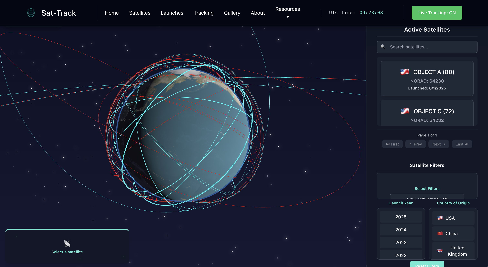

# Sat-Track

**A public, real-time visualizer for the ~30,000 active satellites, debris fragments, and rocket bodies in Earth orbit — plus the Conjunction Data Messages (CDMs) the US Space Force publishes daily.**

[](https://mannyzzle.github.io/Satellite-Interactive-Visualizer-And-Fleet-Optimization/)
[](#license)



---

## Highlights

- **3D globe** with live SGP4 propagation of every active satellite, color-coded by orbit class. Built on Three.js, runs at interactive frame rates with hundreds of meshes.
- **Mission Control / Conjunction Risk Dashboard** (`/tracking`) — forward-looking risk timeline of upcoming close approaches, scored by collision probability, with detail panels per event.
- **Filterable catalog** (`/satellites`) of ~30k objects with country flags, orbit-type pills, status indicators, and URL-synced filter state for shareable deep links.
- **Per-satellite deep dive** (`/satellites/:name`) — animated KPI tiles, mini orbit schematic, tabbed altitude/velocity/B\* charts, and "neighbors in similar orbits" panel.
- **Reentry Watch** (`/reentry`) — leaderboard of LEO objects most imminent to decay, ranked by ballistic-coefficient/perigee imminence score.
- **Launch manifest** (`/launches`) — live countdown to upcoming launches with featured next-launch hero card and color-coded status pills.
- **AI analyst drawer** — natural-language Q&A over the catalog, conjunctions, launches, and space-weather data via streaming tool-calls. Read-only; never invents numbers.
- **Daily AI briefing**, **CDM risk explainers**, **reentry briefings**, and **orbital-maneuver timelines** — all generated from real database state, never from training data.

---

## Architecture

```
┌──────────────────────────────────────────────────────────────────┐
│  Frontend — React + Vite + Three.js + Tailwind                   │
│  Hosted on GitHub Pages (https://mannyzzle.github.io/...)        │
│  Lazy-loaded routes, single source-of-truth API URL config       │
└──────────────────────────┬───────────────────────────────────────┘
                           │  HTTPS read-only GETs
┌──────────────────────────▼───────────────────────────────────────┐
│  Backend — FastAPI on Railway                                    │
│  Public, unauthenticated, CORS-locked, no writes                 │
│  Routes: /api/satellites · /api/cdm · /api/old_tles ·            │
│          /api/launches · /api/reentry · /api/space-weather ·     │
│          /api/digest · /api/llm                                  │
└──────────────────────────┬───────────────────────────────────────┘
                           │  psycopg2 + SSL
┌──────────────────────────▼───────────────────────────────────────┐
│  PostgreSQL on Railway                                           │
│  satellites · satellites_inactive · satellite_tle_history ·     │
│  cdm_events · launches · f107_flux · geomagnetic_kp_index ·      │
│  dst_index · solar_wind · unified_space_weather                  │
└──────────────────────────▲───────────────────────────────────────┘
                           │
┌──────────────────────────┴───────────────────────────────────────┐
│  Ingest workers (GitHub Actions cron)                            │
│  • tle_processor   every 6h  (Space-Track GP catalog)            │
│  • cdm             every 8h  (Space-Track CDM feed)              │
│  • fetch_launches  every 1h  (SpaceLaunchNow / The Space Devs)   │
│  • omni_low        on demand (NOAA SWPC + ACE solar wind)        │
└──────────────────────────────────────────────────────────────────┘
```

**Live URLs**
- Frontend: <https://mannyzzle.github.io/Satellite-Interactive-Visualizer-And-Fleet-Optimization/>
- Backend: <https://satellite-tracker-production.up.railway.app/>

---

## Repository layout

```
.
├── backend/
│   ├── app/
│   │   ├── main.py                # FastAPI app factory, CORS, router mount
│   │   ├── database.py            # psycopg2 + RealDictCursor (SSL required)
│   │   ├── variables.py           # SGP4 / Skyfield helpers, purpose classifier
│   │   ├── tle_fetch.py           # Space-Track GP class fetch + 1h cache
│   │   ├── tle_processor.py       # Archive stale, insert active, classify orbit
│   │   ├── cdm.py                 # Worker: pull CDMs, mark expired
│   │   ├── fetch_launches.py      # SpaceLaunchNow → DB upsert (ON CONFLICT id)
│   │   ├── omni_low.py            # NOAA SWPC + ACE space-weather ingest
│   │   ├── de421.bsp              # JPL planetary ephemeris (Skyfield)
│   │   └── api/
│   │       ├── satellites.py      # /api/satellites/{id|name|nearby|suggest|count|object_types}
│   │       ├── cdm.py             # /api/cdm/fetch
│   │       ├── old_tles.py        # /api/old_tles/fetch/{norad}
│   │       ├── launches.py        # /api/launches/{upcoming,previous}
│   │       ├── reentry.py         # /api/reentry/{upcoming,briefing}
│   │       ├── space_weather.py   # /api/space-weather/*
│   │       ├── digest.py          # /api/digest (daily AI briefing)
│   │       └── llm.py             # /api/llm/{search,ask,…} — tool-using analyst
│   ├── tests/                     # pytest contracts + orbital-mechanics + load (k6)
│   ├── Dockerfile                 # API service image
│   ├── Updater.Dockerfile         # Cron worker image
│   ├── railway.toml
│   └── requirements.txt
├── frontend/
│   ├── src/
│   │   ├── main.jsx, App.jsx
│   │   ├── config.js              # API base URL — VITE_API_BASE_URL override
│   │   ├── pages/                 # Home, Tracking, SatelliteList, SatelliteDetail,
│   │   │                          # Launches, Reentry, About
│   │   ├── components/            # Navbar, KpiTile, Skeleton, RichText,
│   │   │                          # AskSatTrack, NLSearchBar, CDMBriefingCard,
│   │   │                          # DailyDigestCard, ManeuverTimeline, …
│   │   ├── lib/
│   │   │   ├── countries.js       # ISO-ish code → flag emoji + display name
│   │   │   └── satelliteGeometry.js  # Shared THREE geometry/material flyweights
│   │   └── api/satelliteService.js
│   ├── tests/                     # Vitest unit + Playwright e2e + stress
│   └── public/                    # Earth day/night textures, favicon, 404.html
├── .github/workflows/
│   ├── deploy.yml                 # Manual / push-triggered docs
│   └── satellite-tasks.yml        # Cron jobs for ingest workers
├── README.md
└── package.json                   # gh-pages dev-dep for `pnpm run deploy`
```

---

## Run locally

### Prerequisites

- Node 20+ and `pnpm`
- Python 3.11+ with `pip`
- PostgreSQL 14+ (or just point at the deployed Railway database)
- (Optional) `k6` for load tests

### Frontend

```bash
cd frontend
pnpm install
pnpm dev          # http://localhost:5173/Satellite-Interactive-Visualizer-And-Fleet-Optimization/
```

By default the dev frontend talks to the deployed Railway backend. To point at a local backend, create `frontend/.env.local`:

```bash
VITE_API_BASE_URL=http://localhost:8000
```

### Backend

```bash
cd backend
python3 -m venv .venv && source .venv/bin/activate
pip install -r requirements.txt

# Required environment
export DB_HOST=...      # Postgres host
export DB_NAME=...      # Database name
export DB_USER=...
export DB_PASSWORD=...
export DB_PORT=5432

# Optional — only needed if running ingest workers locally
export SPACETRACK_USER=...
export SPACETRACK_PASS=...

uvicorn app.main:app --reload --port 8000
```

### Workers (ingest jobs)

Run individually as needed; production schedules them via the GitHub Actions workflow.

```bash
python3 backend/app/tle_processor.py     # Pull + classify active TLEs
python3 backend/app/cdm.py               # Pull CDMs, mark expired ones
python3 backend/app/fetch_launches.py    # Refresh launch manifest
python3 backend/app/omni_low.py fetch_all  # NOAA SWPC space weather
```

---

## Tests

The project ships with a load-bearing test suite — every group asserts something the product's value props depend on.

```bash
# ─── Backend ────────────────────────────────────────────────────
# API contracts, orbital-mechanics correctness, filter semantics
cd backend
pip install -r tests/requirements-test.txt
pytest -v -m "not load"

# ─── Frontend ───────────────────────────────────────────────────
cd ../frontend

# Vitest unit (jsdom)
pnpm test:unit

# Playwright e2e against the live deploy (or local dev via E2E_BASE_URL)
pnpm exec playwright install
pnpm test:e2e

# Stress: home FPS regression guard + tracking page memory stability
pnpm test:stress

# ─── Load (k6 — hits the read-only production API) ──────────────
brew install k6   # or your platform's k6 install
k6 run backend/tests/load/api_smoke.k6.js
k6 run backend/tests/load/cdm_burst.k6.js
k6 run backend/tests/load/sustained.k6.js
```

What each suite protects:

| Suite | Catches |
|---|---|
| Backend pytest | API contracts (response shapes, status codes), filter-string parsing, propagation correctness for known reference satellites |
| Frontend Vitest | Component-level invariants: navbar route presence, countdown ticking, the AI-output markdown renderer (`RichText`) preserves bold/headings/lists, country code → flag mapping |
| Playwright e2e | Real user flows — home page paint, sidebar search/filter/pagination, satellite detail charts, AI analyst drawer markdown rendering, route navigation + lazy-load |
| Playwright stress | Home page FPS ≥ 10 regression guard, tracking page heap growth < 50% over 60s of interaction |
| k6 load | Public read-only endpoints stay under SLO under burst + sustained traffic |

---

## Deployment

### Frontend (GitHub Pages, manual)

```bash
cd frontend
pnpm run deploy   # runs `vite build` then `gh-pages -d dist`
```

### Backend (Railway, automatic)

Pushes to `main` trigger a Railway build of the API service. Worker images are built fresh on each cron tick from `backend/Updater.Dockerfile` inside the GitHub Actions workflow.

### Ingest cron (GitHub Actions)

Configured in `.github/workflows/satellite-tasks.yml`:

| Job | Schedule | Source |
|---|---|---|
| `tle_processor` | every 6h at :15 | Space-Track GP catalog |
| `cdm` | every 8h at :45 | Space-Track CDM feed |
| `fetch_launches` | every 1h at :30 | SpaceLaunchNow / The Space Devs |
| `fetch_all` | (commented) every 1h at :00 | NOAA SWPC + ACE solar wind |

All workers run inside the `Updater.Dockerfile` image. Logs are uploaded as workflow artifacts.

---

## Data sources & credit

| | |
|---|---|
| **[Space-Track](https://www.space-track.org/)** | TLE catalog, Conjunction Data Messages — auth-required, daily refresh |
| **[NOAA SWPC](https://www.swpc.noaa.gov/)** | F10.7 solar flux, geomagnetic Kp/Ap, Dst, ACE solar wind — public |
| **[The Space Devs / SpaceLaunchNow](https://thespacedevs.com/llapi)** | Upcoming + past launch manifest — public |
| **JPL DE421** | Planetary ephemeris bundled with Skyfield for sun/moon positions |

All endpoints used are publicly documented. The backend caches and serves only read-only `GET`s — there is no write API.

---

## Operating constraints

- **No user accounts, no auth, no writes.** All public endpoints are unauthenticated `GET`s.
- **CORS locked** to `localhost:5173` (dev) + `mannyzzle.github.io` (prod).
- **Database read-only from the API** — every write is gated behind a worker that runs inside the GitHub Actions secret-scoped environment.
- **Never invents data.** AI features (analyst, briefings, digest) call read-only DB tools and answer with real numbers; if a query has no result, the response says so explicitly.

---

## Tech stack

**Frontend** · React 19 · Vite 6 · Three.js 0.173 · Recharts · Framer Motion · Tailwind 4 · `satellite.js` (SGP4) · React Router 7

**Backend** · FastAPI · psycopg2 · Skyfield · `sgp4` · Astropy (TEME→ITRS) · `requests`

**Infra** · Railway (API + Postgres) · GitHub Pages (frontend) · GitHub Actions (cron workers) · Docker (worker image)

**Testing** · pytest · Vitest · Playwright · k6

---

## Contributing

Issues and PRs welcome. Before opening a PR:

1. `cd frontend && pnpm test:unit && pnpm build` — must pass
2. `cd backend && pytest -v -m "not load"` — must pass
3. Verify the live e2e suite locally if your change touches a user-visible flow:  
   `E2E_BASE_URL=http://localhost:5173/Satellite-Interactive-Visualizer-And-Fleet-Optimization/ pnpm exec playwright test --project=e2e-prod`

Coding conventions:

- Frontend: function components only, `lucide-react` for icons (verify icon exists in v1.x — newer ones may be missing), Tailwind utility classes, no emoji used as iconography in UI chrome.
- Backend: raw SQL via `psycopg2` is fine — there is no ORM; keep queries scoped per route.
- AI features: prompts and tool schemas must keep responses grounded in DB data; never expose model identifiers in user-facing strings.

---

## License

[MIT](LICENSE) © Enmanuel Hernandez

Built solo as an exercise in space-domain data engineering and modern frontend craft.
